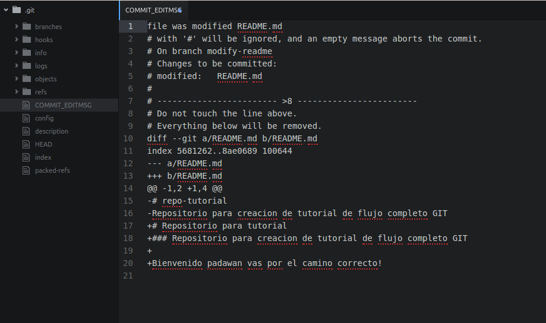
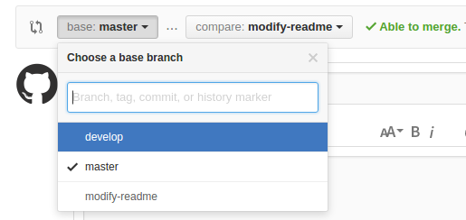

TUTORIAL FLUJO COMPLETO GIT
==
Paos para uso de GIT
--

Explicare paso por paso los comando para poder trabajar con nuestros __repositorios__. Podemos iniciar un repositorio de manera local o bien repositorio remoto, para esto iremos a la web de algun control de versiones de nuestra preferencia.

>*Recordemos un __repositorio__ es un sitio centralizado donde se almacena y mantiene información digital.*

En este tutorial no veremos como trabaja como tal GIT, si llegaste hasta aqui es por que ya pasamos la parte de como funciona, aqui solo haremos un breve enlistado de como crear nuestro primer flujo en GIT.

#### ***Iniciemos!***

Vamos a trabajar sobre repositorio remoto en [GitHub](https://github.com/).
Si ya tienes una cuenta, inicia sesion, para hacer esto mas breve ya tendremos nuestra cuenta iniciada.

Pulsamos en ***Start a project***

Escribimos un nombre para nuestro repositorio, en este caso lo llamaremos *repo-tutorial*, agregamos una descripcion, seleccionamos la pesta;a public e *"Initialize this repository with a README"* , agregamos una licensia, utilizaremos MIT License como se muestra en la siguiente imagen y clic en ***Create repository***.

En la siguiente ventana vemos los archivos creados como LICENSE Y README.md,vamonos directo a ***Clone or download*** hacemos clic y copiamos la URL que nos proporciona *https://github.com/jblancoh/repo-tutorial.git*.

Abrimos nuestra terminal(Recuerda todo se trabaja en terminal) y nos posicionamos en el directorio donde queremos iniciar nuestro proyecto, dentro del directorio escribimos *"git clone"* mas la URL previamente copiada.

Vamos a entrar a nuestro directorio creado al clonar, y verificamos los archivos que tiene nuestro repositorio, como vemos tenemos nuestros archivos LICENSE y README.md.

Venga recuerda **NO** trabajamos con la rama(branch) **MASTER**, vamos a crear nuestra rama develop y la rama que utilizaremos para modificar nuestros archivos, en esta ocasion la llamaremos modify-readme.

Hagamos *"checkout"* a *develop* y antes de avanzar hagamos *"git push origin develop"* para subir la rama principal que modificaremos y no trabajar sobre "master"(esto es fundamental).

Hagamos *"checkout"* a *modify-readme* y comprobamos los archivos de nuevo(Revisarlos constantemente es una buena practica).

Vamos a editar README.md, abrimos nuestro editor de texto atom al igual.

Una vez abierto atom tambien abrimos el *markdown preview*(ctrl+shift+m) para ver como va modificandose nuestro archivo ".md".

Vamos a realizar algunas modificaciones al archivo y guardamos(ctrl+s).

Regresamos a nuestra terminal y veamos el estado del archivo con *"git status"*, vemos el archivo modificado y que se encuentra sin actualizar en git.

Hagamos que pase a un estado de seguimiento con *"git add README.md"*

Revisamos de nuevo el estado, vemos que ya cambio de estado y esta listo para un commit.

Confirmamos los cambios realizados con *"git commit"* agregamos *-v* o *-m* para escribir una breve descripcion de los cambios realizados.

Agregamos "file was modified README.md" en la linea 1, guardamos y cerramos el editor para que continue el proceso.

Ahora subiremos la rama al repositorio remoto *"git push +Nombre de la rama"*, introducimos nuestro nombre de usuario y contrase;a.

Facil no? bueno ahora vamos a la web del git a nuestro repositorio, y encontraremos que hay un pull request por revisar que recientemente lo agrego la rama *modify-readme*, entremos para comparar los cambio con el archivo original

**ESTO ES IMPORTANTE**  
Cambiamos la opcion de rama a develop, es la que recibira los cambios realizados.

Revisamos los cambios, esta practica es para comparar nuestro proyecto con las modificaciones actuales a este.

ya revisado le damos en *create pull request*

Clic en *Merge pull request*

Confirmamos

Vamos a nuestro proyecto, podemos dar clic en repo-tutorial, asi podemos revisar los cambias ya hechos.

Ya en el principal del proyecto cambiamos el branch de *master* a *develop* y podemos ver los cambios realizados.

Vamos al apartado de branches y eliminamos *modify-readme*

Ahora en nuestra terminal procedemos a eliminar esta rama y asi evitar demasiadas que no se utilizaran, cambiamos de rama a develop *"git checkout develop"* y escribirmos *"git branch -D modify-readme"*

Ya para terminar vamos a hacer pull a nuestro repositorio local y asi tener lo que ya esta en lo remoto tambien tenerlo nosotros en nuestra rama develop, escribimos *"git pull origin develop"* y listo ya tenemos los cambios en nuestro repositorio local.

#### ***LISTO!***    
###### Nuestro primer proyecto esta ya en nuestro repositorio remoto, mucho exito y que la fuerza te acompa;e!
