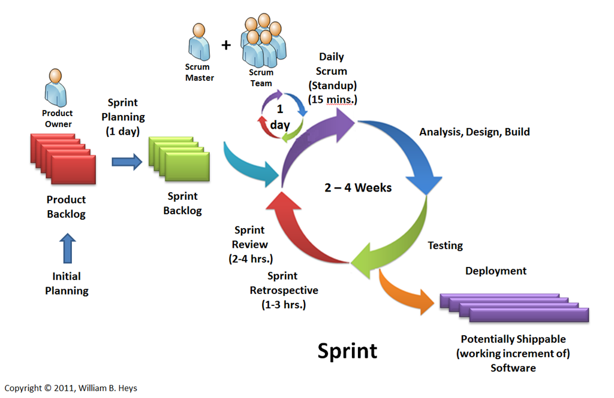

# **¿Qué es un tablero Kanban?**

Es una herramienta para aumentar la productividad, es una manera de gestionar el trabajo de forma fluida, se representa en un tablero Kanban para reflejar los procesos de su flujo de trabajo, es un entorno de trabajo basado en el equipo.

## Como Funciona?

### Existen principio basicos

**Visualice lo que hace(su flujo de trabajo)**: Realizar una visualizacion en una tabla de elemnetos ayudara a que todos los miembros del equipo se mantengan al corriente.

**Limite la cantidad de trabajo en proceso**: Se establecen metas accesibles, se balancea el flujo de trabajo mediante la limitacion de los trabajos en proceso y asi prevenir el exceso de compromiso en la cantdad de tareas que sera incapazar de concluir.

**Lectura facil de indicadores visuales**: Conozca lo qu esta ocurriendo de un solo vistazo, utilizar tarjetas de colores para distinguir los trabajos, prioridades, fechas limite y mas.

**Identique los cuellos de botella y elimine lo que resulta descartable**: Aproveche al maximo los plazos y ciclos de ejecucion, del flujo acumulativo y de los informes de tiempo; Estos criterios le permitiran evaluar el rendimiento y detectar problemas y ajustar el flujo de trabajo en consecuencia.

# **Sprint**
El Sprint es la unidad básica de trabajo para un equipo Scrum. Es una simple *iteración llevada a cabo por los miembros de un equipo.*

Un Sprint inicia con un equipo que se compromete a realizar el trabajo y finaliza con la demostración de un entregable. El tiempo mínimo para un Sprint es de una semana y el máximo es de 4 semanas.

Dentro del desarrollo de un Sprint se llevan a cabo ciertos eventos, estos son:

## Scrum events

1. **Planeamiento del Sprint/Sprint Planning**

  Todos los involucrados en el equipo se reúnen para planificar el Sprint. Durante este evento se decide qué requerimientos o tareas se le asignará a cada uno de los elementos del equipo.

2. **Reunion de Equipo de Scrum/Scrum team meeting**

  Estas reuniones se deben realizar diariamente con un máximo de 15 minutos. En ellas, cada miembro del equipo deberá responder tres simples preguntas:

    + ¿Qué hiciste ayer?
    + ¿Qué tienes planeado hacer hoy?
    + ¿Qué obstáculos encontraste en el camino?    

  Estas reuniones sirven para que todos los miembros del equipo se apoyen entre ellos. Si alguno de ellos tiene algún inconveniente que tome más tiempo del asignado en resolverse.

3. **Refinamiento del Backlog/Backlog Refinement**

  El Product Owner revisa cada uno de los elementos dentro del Product Backlog con el fin de esclarecer cualquier duda que pueda surgir por parte del equipo de desarrolladores.

4. **Revisión del Sprint/Sprint Review**

  Los miembros del equipo y los clientes se reúnen para mostrar el trabajo de desarrollo de software que se ha completado.

  En este punto no es necesario que todos los miembros del equipo hablen. Pueden estar presentes pero la presentación está a cargo del Scrum Master y el Product Owner.

5. **Retrospectiva del Sprint/Retrospective**

  En este evento, el Product Owner se reúne con todo su equipo de trabajo y su Scrum Master para hablar sobre lo ocurrido durante el Sprint. Los puntos principales a tratar en esta reunión son:

    - Qué se hizo mal durante el Sprint para poder mejorar el próximo
    - Qué se hizo bien para seguir en la misma senda del éxito
    - Qué inconvenientes se encontraron y no permitieron poder avanzar como se tenía planificado

# Explicacion breve

## Sprint
- Organiza el trabajo en partes pequeñas y concretas
- Optimiza el proceso en cada iteración
- Durante el Sprint no debe haber cambios de nada
- Se caracteriza por la velocidad de los procesos
- Reuniones diarias hace mas eficaz al equipo.

## Kanban
- Visualiza el flujo de trabajo
- Limita el trabajo en progreso por fases
- No hay roles
- En Kanban cada item en la lista de cosas pendientes no se te indica que debe ser de menor duración al tiempo del Sprint.
- Poca comunicacion entre los miembros del equipo.
