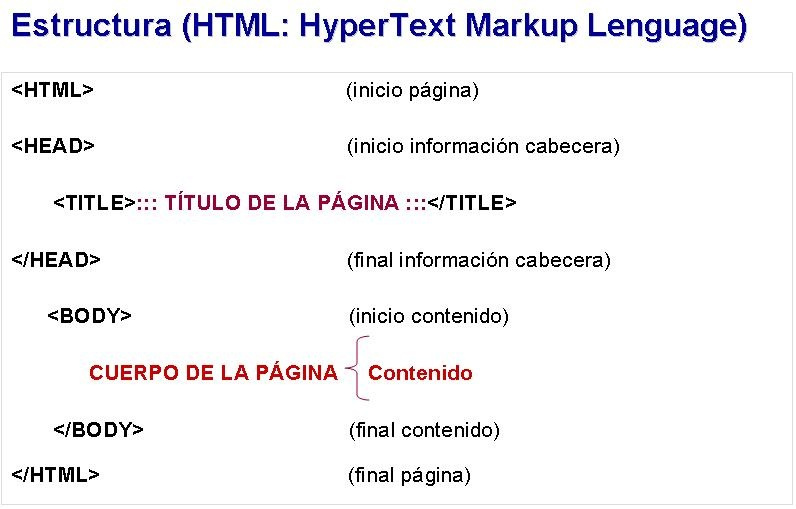
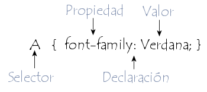

# RESUMEN HTML-CSS

### HTML   
HyperText Markup Language (Lenguaje de Marcado para Hipertextos)es el elemento de construcción más básico de una página web y se usa para crear y representar visualmente una página web. Determina el contenido de la página web, pero no su funcionalidad, HTML le añade "marcado" a un texto estándar.

- HTML se usa para darle estructura a los sitios web.
- Abrimos los archivos HTML usando un navegador, y el navegador nos lo muestra
- Los archivos HTML tienen un encabezado <head> y un cuerpo <body> (Igual que nosotros, que tenemos cabeza y cuerpo).

Enlistamos algunas de las cosas que podemos agregar a los HTML:

1. Imagenes
2. Enlaces
3. Tablas
4. Listas (ordenadas y no ordenadas)

### CSS

Cascading Style Sheets(Hojas de Estilo en Cascada) es el lenguaje utilizado para describir la presentación de documentos HTML o XML. CSS posee una especificación estandarizada por parte del W3C.

Las hojas de estilo en cascada se llaman así porque pueden usarse unas sobre otras para sumar reglas y aplicarlas todas a un mismo documento. Por ejemplo, si indicás que todos los párrafos deben tener la fuente de color azul, pero señalás que un párrafo específico debe tener fuente de color rojo, ¡CSS lo puede hacer!

Una regla CSS se caracteriza por dos elementos principales:

1. Un ***selector de tipo*** para especificar a qué etiquetas del documento se aplica el estilo.
2. Una ***declaración de estilo***, que se define entre paréntesis, para especificar qué estilo aplicar a las etiquetas seleccionadas. A su vez, la declaración está compuesta por:

  - Una o más ***propiedades***, seguidas por el carácter ":" (dos puntos)
  - Uno o más ***valores*** asociados a cada propiedad, entre comillas y separados por comas si hay múltiples valores, y todos seguidos por un punto y coma.

Por lo tanto, la sintaxis es:

